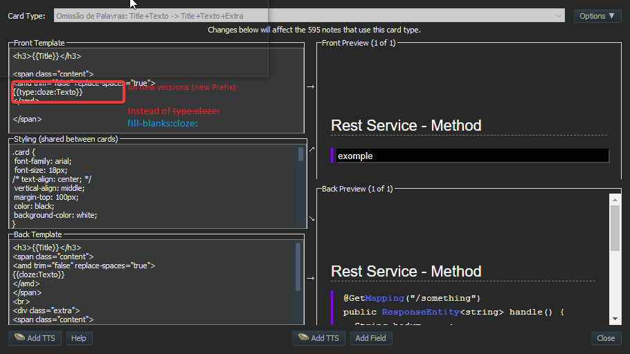

# Fill the blanks - Type in your cloze answers

> *TLDR;*  
> This addon lets you type in the answers on cloze cards, with one input field per cloze part

With the addon applied:  

## Motivation

Typing in the answers are interesting for studying. For many people, writing is more efficient for memorization than just reading.  
On cloze cards, when hiding just the cloze parts, it's possible to study contents within a context.  

Anki's built-in `{{type:cloze:...}}` doesn't work well with that combination: on a cloze card it replaces the entire
content with a single *input text*.  

This addon solves this issue with its own template filter, `fill-blanks:`.  

> Note from dev: At first, I'm using it for source code blocks. Soon, I think about using for cards with language (ex: German) phrases as well

## How it works

* Create a card of type Cloze deletion

* On the note templates editor, use `{{fill-blanks:cloze:fieldName}}` on the front. Leave the back as `{{cloze:fieldName}}`

> Screenshot is outdated: it shows the old `type:cloze:` syntax, removed in *25.3-1*.

* Then, on review time, the cloze parts will be replaced with *input texts*

> Note: this addon does not create a new note type. You need to either edit or duplicate an existing Cloze note type.

## Extra feature

### Instant feedback

While the user types in the answer, the corresponding input field changes.
The background color changes according to the value:

* incomplete: yellow
* correct: green
* case error (e.g. "hello" vs "Hello"): blue
* punctuation/spacing error (e.g. "hello world" vs "hello, world"): orange
* incorrect: red

**Configurations:**  

It's possible to enable/disable feedback, ignore case (upper/lower) and ignore accents through configurations.

For details, refer to [Configuration](src/config.md)

### Answer feedback

> From 2.0

Especially for those who disable _instant feedback_, on "Show answer" the add-on also provides a feedback per field.

## Bugs / Suggestions / more...

Please, feel free to make suggestions and open issues about possible bugs found.

Source code and issues: [GitHub](https://github.com/ryndovaira/anki-plugins/tree/master/fill-the-blanks)

## Updates

> Check [RELEASE_NOTES](RELEASE_NOTES.md)

## About

Originally developed by [ssricardo](https://github.com/ssricardo/anki-plugins).
Currently maintained by [ryndovaira](https://github.com/ryndovaira/anki-plugins).